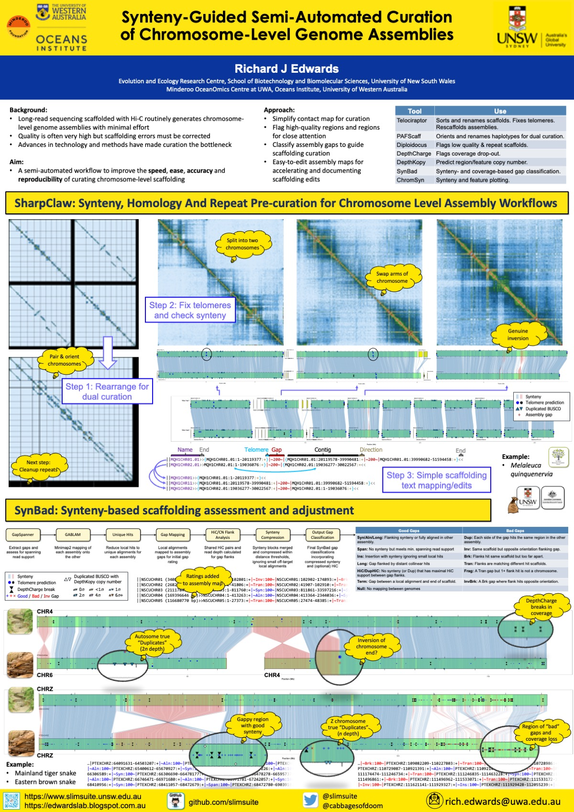

# SharpClaw: Synteny, Homology And Repeat Pre-curation for Chromosome-Level Assembly Workflows

This is a placeholder for the SharpClaw workflow for accelerating and assisting curation of chromosome-level genome assemblies, with a focus on phased diploid genomes. Details will be added as the workflow is developed and tested. An introduction to some elements is provided in the [PAG Australia 2024 Poster](./figures/2024-09-14.RJE.PAG-Curation-Poster.jpg), below.

In broad terms, SharpClaw makes use of the following steps and tools:

1. [Telociraptor](https://github.com/slimsuite/telociraptor) chromsort of the hap1 assembly.
2. [PAFScaff](https://github.com/slimsuite/pasfscaff) scaffold each haplotype against each other for consistent naming and orientation.
3. [Telociraptor](https://github.com/slimsuite/telociraptor) tweak of each haplotype and combine to make a diploid for the dual curation.
4. Generate HiC contact maps and visualise in [PreText](https://github.com/sanger-tol/PretextView) for sorted and unsorted diploids.
5. Run [Compleasm](https://github.com/huangnengCSU/compleasm) on two haplotypes and combine into diploid.
6. [barrnap](https://github.com/tseemann/barrnap) rRNA predictions for ChromSyn plots and rRNA contig identification.
7. Simple [ChromSyn](https://github.com/slimsuite/chromsyn) Compleasm synteny plot.
8. Diploid Read Mapping for DepthKopy, DepthCharge and Diploidocus.
9. [DepthCharge](depthcharge) identification of coverage dropout.
10. KAT kmer and self-homology generation for DepthKopy and Diploidocus.
11. [DepthKopy](https://github.com/slimsuite/depthkopy) CN estimation for ChromSyn plots.                  
12. [SynBad](https://github.com/slimsuite/synbad) Gap classification.                                   
13. Detailed [ChromSyn](https://github.com/slimsuite/chromsyn) plots with DepthCharge, CN and SynBad gap classification.
14. [Diploidocus](https://github.com/slimsuite/diploidocus) classification for reduced PreText.              
15. Reduced PreText generation without repeat scaffolds.  

SharpClaw is being developed and tested on animal and plant genomes. Please get in touch if you would like to try it out whilst in development.

